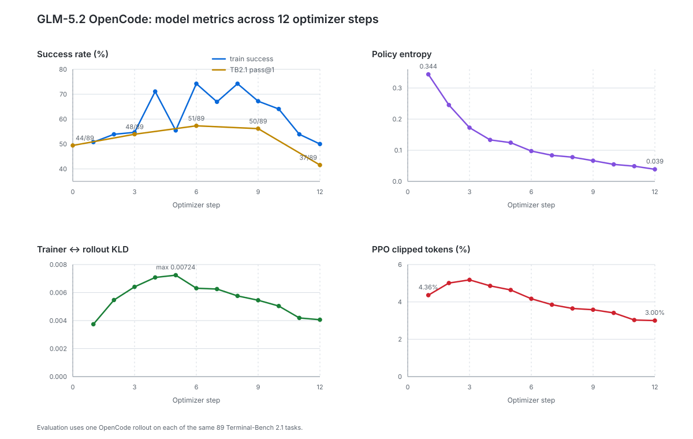

# GLM-5.2 OpenCode GRPO: four-epoch report

[W&B run `sovf8iiv`](https://wandb.ai/myh97/terminal-rl/runs/sovf8iiv) ·
[recipe and implementation PR #779](https://github.com/rllm-org/rllm/pull/779)

## Result

Learning peaked at epoch 2, plateaued in epoch 3, and degraded in epoch 4.
Trainer/rollout KLD stayed low throughout. The best measured checkpoint is
**step 6**, not the final checkpoint.

| Checkpoint | Fixed-curriculum success | Useful groups | TB2.1 |
|---|---:|---:|---:|
| Base | — | — | 44/89 (49.4%) |
| Epoch 1 / step 3 | 204/384 (53.1%) | 37/48 | 48/89 (53.9%) |
| Epoch 2 / step 6 | 257/384 (66.9%) | 37/48 | **51/89 (57.3%)** |
| Epoch 3 / step 9 | 266/383 (69.5%) | 37/48 | 50/89 (56.2%) |
| Epoch 4 / step 12 | 215/384 (56.0%) | 43/48 | **37/89 (41.6%)** |

## Experiment

The 48 fixed training tasks came from the 1,200-task `tb-opus-pass/train`
archive. Selection required eight prior OpenCode `ENV_DONE` rollouts with 3–5
successes, giving GRPO informative groups. This was prior-checkpoint evidence,
not a frozen-base sweep. Coarse distribution: systems 10, security 9,
algorithms 8, scientific/ML 10, data/applications 7, compilers/formal methods 4.

Evaluation used one temperature-1 OpenCode rollout on all 89 pinned
`terminal-bench@2.1` tasks. Training and evaluation have no shared task IDs or
exact instructions. The matched 44/89 base came from
[run `xf985hrc`](https://wandb.ai/myh97/terminal-rl/runs/xf985hrc) and was not
rerun.

| Item | Setting |
|---|---|
| Model | GLM-5.2 FP8; full-parameter `glm-5p2-200k` shape |
| RL | Strict-sync on-policy GRPO; PPO clip 0.2; R3; AdamW; LR `1e-6` |
| Batch/schedule | 16 groups × 8 rollouts = 128/step; 3 steps/epoch; 4 epochs |
| Runtime | Temperature/top-p 1.0; 188,352 + 16,384 tokens; 30-minute timeout |
| Filtering | Compact-filter errors; retain timeouts and uniform zero-advantage groups |
| Evaluation | 89 TB2.1 tasks after steps 3, 6, 9, 12 |
| Resources | 2 logical trainer replicas + 6 rollout replicas = 10 nodes |

### Why earlier recipes were inconclusive

| Recipe | Observation | Lesson |
|---|---|---|
| Async, broad pool ([OpenCode](https://wandb.ai/myh97/terminal-rl/runs/8t4pi3fr), [Terminus-2](https://wandb.ai/myh97/terminal-rl/runs/56qstvki)) | Partial rollouts, staleness ≤3, changing tasks, no matched evaluations | Reward was not attributable |
| Strict-sync, broad pool ([OpenCode](https://wandb.ai/myh97/terminal-rl/runs/xf985hrc), [Terminus-2](https://wandb.ai/myh97/terminal-rl/runs/udjgkhue)) | OpenCode 44→44→42/89; Terminus-2 35→29/89; few useful groups | Sync fixed policy age, but near-single-pass data gave weak gradients |

Hence this run used one harness, a fixed medium-difficulty curriculum, repeated
epochs, and epoch-boundary evaluation.

## Base and twelve optimizer steps

“Useful” means the group contains both successes and failures. E/H is the
number of uniform all-pass/all-fail groups. Eval gains and regressions are
paired on the same 89 task IDs against the preceding evaluation.

| Step | Epoch | Train success | Useful | E/H | Entropy | PPO clipped | KLD | TB2.1 passed | Gained | Regressed |
|---:|---:|---:|---:|---:|---:|---:|---:|---:|---:|---:|
| 0 | Base | — | — | — | — | — | — | 44/89 (49.4%) | — | — |
| 1 | 1 | 65/128 (50.8%) | 10/16 | 3/3 | 0.3438 | 4.36% | 0.00374 | — | — | — |
| 2 | 1 | 69/128 (53.9%) | 13/16 | 2/1 | 0.2454 | 5.01% | 0.00547 | — | — | — |
| 3 | 1 | 70/128 (54.7%) | 14/16 | 2/0 | 0.1726 | 5.18% | 0.00641 | 48/89 (53.9%) | 11 | 7 |
| 4 | 2 | 91/128 (71.1%) | 11/16 | 5/0 | 0.1332 | 4.86% | 0.00708 | — | — | — |
| 5 | 2 | 71/128 (55.5%) | 13/16 | 3/0 | 0.1243 | 4.64% | 0.00724 | — | — | — |
| 6 | 2 | 95/128 (74.2%) | 13/16 | 3/0 | 0.0975 | 4.17% | 0.00631 | 51/89 (57.3%) | 7 | 4 |
| 7 | 3 | 85/127 (66.9%) | 15/16 | 1/0 | 0.0837 | 3.85% | 0.00625 | — | — | — |
| 8 | 3 | 95/128 (74.2%) | 12/16 | 3/1 | 0.0778 | 3.65% | 0.00576 | — | — | — |
| 9 | 3 | 86/128 (67.2%) | 10/16 | 6/0 | 0.0664 | 3.58% | 0.00545 | 50/89 (56.2%) | 8 | 9 |
| 10 | 4 | 82/128 (64.1%) | 15/16 | 1/0 | 0.0546 | 3.41% | 0.00504 | — | — | — |
| 11 | 4 | 69/128 (53.9%) | 13/16 | 2/1 | 0.0488 | 3.03% | 0.00419 | — | — | — |
| 12 | 4 | 64/128 (50.0%) | 15/16 | 0/1 | 0.0387 | 3.00% | 0.00406 | 37/89 (41.6%) | 4 | 17 |

## Diagnosis

- **Learning:** Base → step 6 gained 7 TB2.1 tasks (+7.9 points); curriculum
  success rose 53.1% → 66.9%.
- **Plateau:** Epoch 3 reached 69.5% curriculum success but TB2.1 moved 51 → 50.
- **Degradation:** Step 9 → 12 had 4 gains and 17 losses on the same 89 tasks
  (exact paired McNemar \(p=0.0072\)). Non-`ENV_DONE` counts changed only
  12 → 13. Curriculum success simultaneously fell 69.5% → 56.0% despite 43/48
  useful groups. This is continued-policy degradation, not task-mix noise.
- **Sharpening, not numerical drift:** Entropy fell 0.3438 → 0.0387 (−88.7%),
  while PPO clipping stayed 3–5%, gradients stayed bounded, and `offpolicy/kl`
  stayed 0.00374–0.00724. KLD validates trainer/rollout alignment; it is not
  reference KL and cannot prevent harmful cumulative policy drift.

Use `val/reward/mean` or the canonical `evaluation/tb21/*` overlay for the
89-task result. `val/reward/opencode/mean` excludes masked episodes and is not
the benchmark pass rate.
