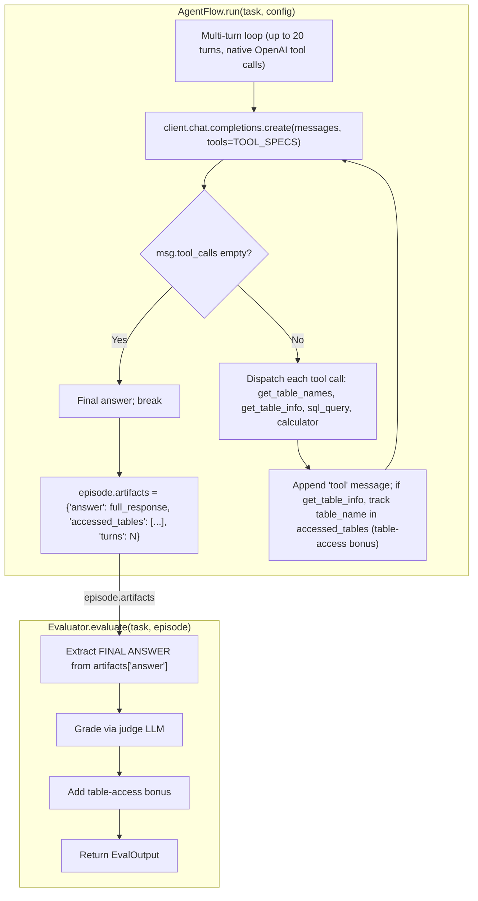

A multi-turn ReAct-style financial-QA agent that answers questions about SEC 10-K financial statements by querying structured tables. Four tools are exposed via native OpenAI function calling.

## Pattern

| Aspect | Value |
|---|---|
| Loop shape | Multi-turn (up to 20 tool calls per task) |
| Tools | 4: `get_table_names`, `get_table_info`, `sql_query`, `calculator` |
| State | Process-wide SQLite `:memory:` DB pre-loaded with ~6,900 tables across 207 companies |
| Termination | Model emits `FINAL ANSWER:` block (no tool call) or hits max turns |
| Reward shape | Judge-LLM rubric (gpt-5-nano single-table, gpt-5-mini multi-table) + table-access bonus |

## Architecture



[Model Weights](https://huggingface.co/rLLM/rLLM-FinQA-4B) | [Dataset](https://huggingface.co/datasets/rLLM/finqa)

## Install

```bash
uv pip install -e ".[tinker]"                      # rllm + tinker backend
uv pip install --no-deps -e cookbooks/finqa        # this cookbook
rllm agent list                                    # should show "finqa"
```

## Dataset

```bash
python cookbooks/finqa/prepare_data.py
```

Downloads the [`rLLM/finqa`](https://huggingface.co/datasets/rLLM/finqa) tarball, extracts company tables to `cookbooks/finqa/data/company_tables/`, and registers `finqa/{train, val, test}` (4,030 / 522 / 558 rows).

The data tree is large (~6,900 tables) — use `FINQA_TABLES_ROOT` env var to point at a shared mount if you have one.

## Eval

The judge calls `gpt-5-nano` / `gpt-5-mini` directly via `openai.OpenAI()` — set your `OPENAI_API_KEY` first:

```bash
export OPENAI_API_KEY=sk-…

rllm eval finqa \
    --agent finqa \
    --evaluator finqa \
    --model rLLM/rLLM-FinQA-4B \
    --base-url http://localhost:30000/v1 \
    --split test \
    --max-examples 20
```

If `OPENAI_API_KEY` is missing the evaluator silently returns `reward=0` rather than crashing — useful for smoke tests without the gateway.

## Training

```bash
export OPENAI_API_KEY=sk-…

# Tinker (LoRA on 30B)
bash cookbooks/finqa/train_tinker.sh

# Verl (distributed multi-GPU)
bash cookbooks/finqa/train_verl.sh
```

## Key code

The flow is the canonical multi-turn-tool-call template:

```python
@rllm.rollout(name="finqa")
async def finqa_flow(task: Task, config: AgentConfig) -> Episode:
    client = AsyncOpenAI(base_url=config.base_url, api_key="EMPTY")
    messages = [
        {"role": "system", "content": SYSTEM_PROMPT},
        {"role": "user", "content": task.metadata.get("question")},
    ]

    accessed_tables, steps, final = [], [], ""
    for turn in range(MAX_TURNS):
        resp = await client.chat.completions.create(
            model=config.model, messages=messages, tools=TOOL_SPECS, ...,
        )
        msg = resp.choices[0].message
        messages.append(_msg_to_dict(msg))
        steps.append(Step(chat_completions=list(messages), model_response=msg.content or "", ...))

        if not msg.tool_calls:
            final = msg.content or ""
            break

        for tc in msg.tool_calls:
            output = _exec_tool_call(tc, accessed_tables)
            messages.append({"role": "tool", "tool_call_id": tc.id, "content": output})

    return Episode(
        trajectories=[Trajectory(name="finqa", steps=steps)],
        artifacts={"answer": final, "accessed_tables": accessed_tables, "turns": len(steps)},
    )
```

Tools are plain Python callables paired with an OpenAI function spec — no `Tool` base class, no registry. The 4 tools share a process-wide SQLite store loaded once at module import:

```python
TOOL_FNS = {
    "get_table_names": get_table_names,    # list company → tables
    "get_table_info": get_table_info,      # column metadata + sample values
    "sql_query": sql_query,                 # filtered SELECT against in-memory DB
    "calculator": calculator,               # asteval safe arithmetic
}

TOOL_SPECS = [
    {"type": "function", "function": {"name": "get_table_names", ...}},
    {"type": "function", "function": {"name": "get_table_info", ...}},
    ...
]
```

## Files

| File | Description |
|---|---|
| `finqa_flow.py` | Multi-turn AgentFlow with native tool calling |
| `finqa_tools.py` | The 4 tools as plain functions + OpenAI tool specs |
| `finqa_eval.py` | Judge-LLM correctness + table-access bonus |
| `finqa_constants.py` | Path constants |
| `prepare_data.py` | HF download + DatasetRegistry registration |
| `train.py` + `train_{tinker,verl}.sh` | Hydra entry points |
| `pyproject.toml` | Plugin entry-point declarations |
| `test.py` | 17 unit tests (calculator, tool-spec/fn alignment, FINAL ANSWER parsing, table-access scoring) |
| `prompts/` | System + correctness rubric prompts |

## On GitHub

<Card title="cookbooks/finqa" icon="github" href="https://github.com/rllm-org/rllm/tree/main/cookbooks/finqa">
  Full source, README, and runnable launch scripts
</Card>
