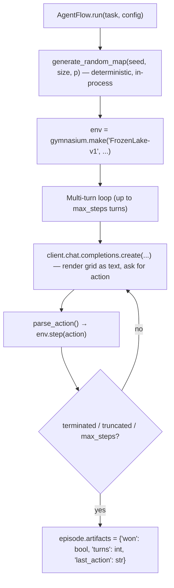

A multi-turn agent flow that trains a model to navigate procedurally-generated FrozenLake puzzles via the **AgentFlow protocol**. This is the cookbook to copy if your agent drives a Gym-style environment.

## Pattern

| Aspect | Value |
|---|---|
| Loop shape | Multi-turn (up to `max_steps` per puzzle) |
| Tools | None — the gym env IS the action space (`Up`/`Down`/`Left`/`Right`) |
| State | Per-task: a freshly-seeded `gymnasium.make("FrozenLake-v1", desc=…)` |
| Termination | Goal reached, hole reached, or `max_steps` exhausted |
| Reward shape | Per-task scalar — `1.0` if won, `0.0` otherwise |

## Architecture



The cookbook is fully self-contained — there's no dependency on `rllm.environments`. The map is regenerated deterministically from `(seed, size, p)` every time the flow runs, so the dataset stores only those parameters.

## Install

```bash
uv pip install -e ".[tinker]"                          # rllm + tinker backend
uv pip install --no-deps -e cookbooks/frozenlake       # this cookbook (gymnasium pulled in transitively)
rllm agent list                                        # should show "frozenlake"
```

## Dataset

Procedurally generated — no download. Run once:

```bash
python cookbooks/frozenlake/prepare_data.py
# Or with custom sizes:
python cookbooks/frozenlake/prepare_data.py --train-size 5000 --test-size 200 --slippery
```

Registers `frozenlake/{train, test}` with `DatasetRegistry`.

## Eval

```bash
rllm eval frozenlake \
    --agent frozenlake \
    --evaluator frozenlake \
    --model Qwen/Qwen3-4B-Instruct-2507 \
    --base-url http://localhost:8000/v1 \
    --split test \
    --max-examples 20
```

## Training

```bash
# Single-machine LoRA (tinker)
bash cookbooks/frozenlake/train_tinker.sh

# Distributed multi-GPU (verl)
bash cookbooks/frozenlake/train_verl.sh
```

Or via the CLI with default knobs:

```bash
rllm train frozenlake \
    --agent frozenlake \
    --evaluator frozenlake \
    --model Qwen/Qwen3-4B-Instruct-2507 \
    --group-size 8 \
    --batch-size 32 \
    --lora-rank 32
```

## Key code

The flow body is straightforward — drive `env.step` with whatever the model emits in triple-backticks:

```python
@rllm.rollout(name="frozenlake")
async def frozenlake_flow(task: Task, config: AgentConfig) -> Episode:
    meta = task.metadata or {}
    desc = generate_random_map(size=meta["size"], p=meta["p"], seed=meta["seed"])
    env = gym.make("FrozenLake-v1", desc=desc, is_slippery=meta["is_slippery"])
    env.reset(seed=meta["seed"])

    client = AsyncOpenAI(base_url=config.base_url, api_key="EMPTY")
    messages = [
        {"role": "system", "content": SYSTEM_PROMPT},
        {"role": "user", "content": render_first_turn(env, max_turns)},
    ]

    steps, won = [], False
    for turn in range(max_turns):
        resp = await client.chat.completions.create(model=config.model, messages=messages, ...)
        content = resp.choices[0].message.content or ""
        action = parse_action(content)         # e.g. "```Up```" → 3
        messages.append({"role": "assistant", "content": content})
        steps.append(Step(chat_completions=list(messages), action=_ACTION_LABELS.get(action), …))

        if action is None:
            messages.append({"role": "user", "content": "Please reply with a valid action…"})
            continue

        _, reward, terminated, truncated, _ = env.step(action)
        if terminated:
            won = float(reward) > 0
            break
        if truncated:
            break
        messages.append({"role": "user", "content": render_next_turn(env, turn + 1)})

    return Episode(
        trajectories=[Trajectory(name="frozenlake", steps=steps)],
        artifacts={"won": won, "turns": len(steps)},
        is_correct=won,
    )
```

## Files

| File | Description |
|---|---|
| `frozenlake_flow.py` | The AgentFlow + map generator + action parser |
| `evaluator.py` | Reads `artifacts["won"]` → `EvalOutput` |
| `prepare_data.py` | Generates `(seed, size, p)` rows + registers via `DatasetRegistry` |
| `train.py` + `train_{tinker,verl}.sh` | Hydra entry points |
| `pyproject.toml` | Plugin entry-point declarations |
| `test.py` | 12 unit tests (map gen, parsing, rendering, evaluator) |

## On GitHub

<Card title="cookbooks/frozenlake" icon="github" href="https://github.com/rllm-org/rllm/tree/main/cookbooks/frozenlake">
  Full source, README, and runnable launch scripts
</Card>
