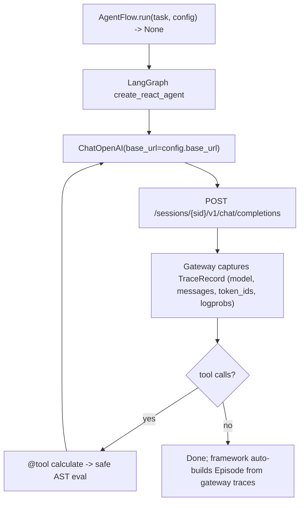

A multi-turn math agent authored with [LangGraph](https://github.com/langchain-ai/langgraph)'s `create_react_agent`, trained end-to-end with rLLM. Demonstrates that any LangGraph agent integrates with rLLM training **without writing a callback handler** — pointing LangChain's `ChatOpenAI` at `config.base_url` is enough, because the rLLM model gateway captures every LLM call.

This cookbook is the AgentFlow-protocol counterpart of the legacy [`rllm.sdk.integrations.langgraph`](/sdk/integrations) callback-handler approach (now deprecated). It is intentionally a near-clone of [`cookbooks/math_tool_agent`](/cookbooks/math_tool_agent) so you can compare a hand-rolled tool loop against a LangGraph one on the same dataset.

## Pattern

| Aspect | Value |
|---|---|
| Loop shape | Multi-turn (LangGraph `recursion_limit=25`) |
| Tools | One: `calculate` — AST-based safe arithmetic interpreter |
| Termination | LangGraph stops when the LLM emits no further tool calls |
| Reward shape | `1.0` if final answer matches ground truth (mathd + sympy), else `0.0` |
| Return type | `None` — the gateway captures everything; the framework auto-builds the Episode |

## Why so little code?

```python
@rllm.rollout(name="langgraph-math")
async def langgraph_math(task: Task, config: AgentConfig) -> None:
    llm = ChatOpenAI(
        model=config.model,
        base_url=config.base_url,
        api_key="EMPTY",
        temperature=1.0,
    )
    agent = create_react_agent(llm, tools=[calculate], prompt=SYSTEM_PROMPT)
    await agent.ainvoke({"messages": [("user", task.instruction)]})
    return None
```

That's the whole agent. No callback handler, no message format conversion, no manual `Step` / `Trajectory` construction. The mechanism:

- LangChain's `ChatOpenAI(base_url=…)` issues OpenAI Chat Completions requests against the gateway session URL the trainer provides.
- The gateway middleware extracts the session id from the URL path (`/sessions/{sid}/v1/...`) and persists every request/response as a `TraceRecord` keyed by that session.
- The flow returns `None`. The framework's coercion (`rllm.types._coerce_to_episode`) builds an empty single-trajectory `Episode`. During enrichment the gateway's traces become the trajectory's `Step`s, populated with prompt/response token IDs and per-token logprobs ready for training.
- The evaluator reads the agent's final assistant message from `episode.trajectories[-1].steps[-1].model_response` and grades it against ground truth.

Because the trajectory's `name` is `"langgraph-math"` (set on `@rllm.rollout`), all rollouts of the same task hash to the same `f"{task_id}:langgraph-math"` key when the trainer builds `TrajectoryGroup`s for GRPO advantage computation.

## Architecture



## Install

```bash
uv pip install -e ".[tinker]"                          # rllm + tinker backend
uv pip install --no-deps -e cookbooks/langgraph_math   # this cookbook + LangGraph deps
rllm agent list                                         # should show "langgraph_math"
```

## Datasets

Same datasets as [`math_tool_agent`](/cookbooks/math_tool_agent) so you can compare learning curves between a hand-rolled tool loop and a LangGraph one:

```bash
rllm dataset pull deepscaler_math   # ~40K AIME/AMC/Omni-MATH/STILL competition math (train)
rllm dataset pull math500           # 500-problem test benchmark
```

## Eval

```bash
rllm eval math500 \
    --agent langgraph_math \
    --evaluator langgraph_math \
    --model Qwen/Qwen3-4B-Instruct-2507 \
    --base-url http://localhost:8000/v1 \
    --max-examples 20
```

## Training

```bash
# Tinker (single-machine LoRA)
bash cookbooks/langgraph_math/train_tinker.sh

# Verl (distributed GPU)
bash cookbooks/langgraph_math/train_verl.sh
```

The tool-call training uses verl's vLLM tool-call parser (already wired into `train_verl.sh`):

```bash
+actor_rollout_ref.rollout.engine_kwargs.vllm.enable_auto_tool_choice=true
+actor_rollout_ref.rollout.engine_kwargs.vllm.tool_call_parser=hermes
```

## Evaluator

The flow returned `None`, so `episode.artifacts` is empty. The evaluator extracts the answer directly from the gateway-captured trajectory — that's the canonical "evaluator parses the Trajectory" pattern under AgentFlow:

```python
def _last_assistant_text(episode: Episode) -> str:
    """Walk back through Steps to find the last assistant message."""
    if not episode.trajectories:
        return ""
    for step in reversed(episode.trajectories[-1].steps):
        if step.model_response:
            return step.model_response
    return ""

@rllm.evaluator
def langgraph_math_evaluator(task: dict, episode: Episode) -> EvalOutput:
    answer_text = _extract_answer(_last_assistant_text(episode))
    ground_truth = str(task.get("answer") or task.get("ground_truth") or "")
    is_correct = grade_answer_mathd(answer_text, ground_truth) or grade_answer_sympy(answer_text, ground_truth)
    return EvalOutput(
        reward=1.0 if is_correct else 0.0,
        is_correct=is_correct,
        signals=[Signal(name="accuracy", value=1.0 if is_correct else 0.0)],
    )
```

The walk-back loop matters: in a tool-using ReAct agent, the trajectory ends with an assistant turn, but tool-message Steps in between have empty `model_response`. The evaluator walks backwards until it finds the last assistant turn.

## Files

| File | Description |
|---|---|
| `langgraph_math.py` | The `create_react_agent` AgentFlow + safe calculator |
| `evaluator.py` | Reads answer from gateway-captured trajectory |
| `train.py` + `train_{tinker,verl}.sh` | Hydra entry points |
| `pyproject.toml` | Plugin entry-point declarations |
| `test.py` | Unit tests for calculator, parsing, and evaluation |

## Migration from `rllm.sdk.integrations.langgraph`

If you previously used `RLLMTrajectoryCallbackHandler` to capture LangChain's LLM calls into rLLM `Trajectory` objects in-process, that path is **deprecated** for training. The gateway now provides token-accurate trace capture out of band, so for any LangGraph agent that uses `ChatOpenAI` (or any other LangChain client that accepts a `base_url`) the integration collapses to:

```python
llm = ChatOpenAI(base_url=config.base_url, api_key="EMPTY", model=config.model)
# ...build your graph as usual...
return None
```

The callback handler still works for non-rLLM-training contexts where you need in-process trajectory snapshots, but for training under `AgentTrainer` you should use this cookbook's pattern instead.

## On GitHub

<Card title="cookbooks/langgraph_math" icon="github" href="https://github.com/rllm-org/rllm/tree/main/cookbooks/langgraph_math">
  Full source, README, and runnable launch scripts
</Card>
