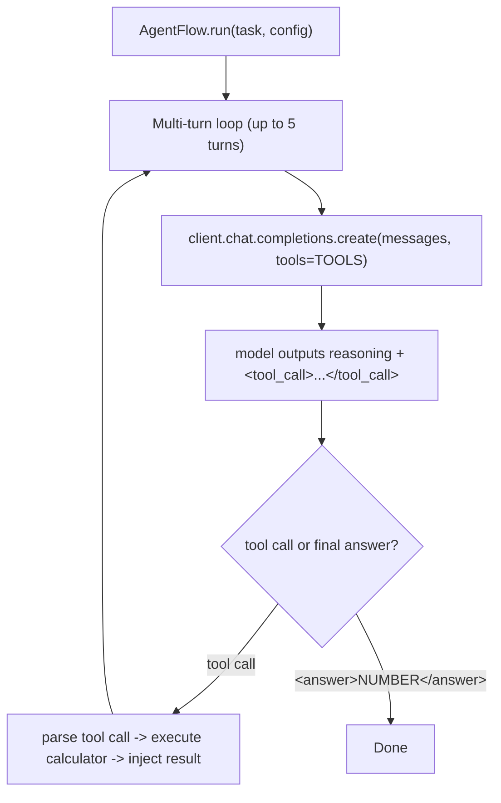

A multi-turn agent that solves competition math problems by calling a calculator tool through native OpenAI function calling. Use this when you want the model to learn explicit tool use; for plain chain-of-thought math see [`math`](/cookbooks/math).

## Pattern

| Aspect | Value |
|---|---|
| Loop shape | Multi-turn (up to 5 calculator calls per task) |
| Tools | One: `calculate` — `asteval`-based safe arithmetic interpreter |
| Termination | Model emits `<answer>NUMBER</answer>` (no tool call) or hits `MAX_TURNS` |
| Reward shape | `1.0` if final answer matches ground truth (mathd + sympy), else `0.0` |

## Architecture



The evaluator checks the final `<answer>` against the ground truth via numeric comparison.

## Install

```bash
uv pip install -e ".[tinker]"                              # rllm + tinker backend
uv pip install --no-deps -e cookbooks/math_tool_agent      # this cookbook
rllm agent list                                            # should show "math_tool_agent"
```

## Datasets

```bash
rllm dataset pull deepscaler_math   # ~40K AIME/AMC/Omni-MATH/STILL competition math (train)
rllm dataset pull math500           # 500-problem test benchmark
```

## Eval

```bash
rllm eval math500 \
    --agent math_tool_agent \
    --evaluator math_tool \
    --model Qwen/Qwen3-4B-Instruct-2507 \
    --base-url http://localhost:8000/v1 \
    --max-examples 20
```

## Training

```bash
# Tinker (single-machine LoRA)
bash cookbooks/math_tool_agent/train_tinker.sh

# Verl (distributed GPU)
bash cookbooks/math_tool_agent/train_verl.sh
```

The tool-call training requires verl's vLLM tool-call parser:

```bash
+actor_rollout_ref.rollout.engine_kwargs.vllm.enable_auto_tool_choice=true
+actor_rollout_ref.rollout.engine_kwargs.vllm.tool_call_parser=hermes
```

(Already wired into `train_verl.sh`.)

## Key code

The flow drives a fixed-iteration tool-calling loop:

```python
@rllm.rollout(name="math-tool-agent")
async def math_tool_agent(task: Task, config: AgentConfig) -> Episode:
    client = AsyncOpenAI(base_url=config.base_url, api_key="EMPTY")
    messages = [
        {"role": "system", "content": SYSTEM_PROMPT},
        {"role": "user", "content": task.instruction},
    ]

    steps, final_answer = [], ""
    for turn in range(MAX_TURNS):
        response = await client.chat.completions.create(
            model=config.model, messages=messages, tools=TOOLS, ...,
        )
        msg = response.choices[0].message
        messages.append(_msg_to_dict(msg))
        steps.append(Step(chat_completions=list(messages), model_response=msg.content, action=msg.content))

        if msg.tool_calls:
            for tc in msg.tool_calls:
                args = json.loads(tc.function.arguments)
                result = _safe_eval(args["expression"])
                messages.append({"role": "tool", "tool_call_id": tc.id, "content": result})
        else:
            final_answer = _extract_answer(msg.content)
            break

    return Episode(
        trajectories=[Trajectory(name="solver", steps=steps)],
        artifacts={"answer": final_answer},
    )
```

The calculator is a sandboxed AST walker:

```python
def _safe_eval(expression: str) -> str:
    tree = ast.parse(expression, mode="eval")
    for node in ast.walk(tree):
        if not isinstance(node, _ALLOWED_NODES):
            return f"Error: disallowed syntax ({type(node).__name__})"
        if isinstance(node, ast.Name) and node.id not in _SAFE_NAMES:
            return f"Error: unknown name '{node.id}'"
    result = eval(compile(tree, "<expr>", "eval"), {"__builtins__": {}}, _SAFE_NAMES)
    return str(result)
```

Whitelisted names cover `sqrt`, `log`, `sin`, `cos`, `factorial`, `comb`, `gcd`, `lcm`, `pi`, `e`, `tau`, … — anything outside the whitelist raises an error string the model sees.

## Files

| File | Description |
|---|---|
| `math_tool_agent.py` | The multi-turn AgentFlow + safe calculator |
| `evaluator.py` | Numeric / symbolic answer comparison |
| `train.py` + `train_{tinker,verl}.sh` | Hydra entry points |
| `pyproject.toml` | Plugin entry-point declarations |
| `test.py` | Unit tests covering calculator and answer parsing |

## On GitHub

<Card title="cookbooks/math_tool_agent" icon="github" href="https://github.com/rllm-org/rllm/tree/main/cookbooks/math_tool_agent">
  Full source, README, and runnable launch scripts
</Card>
