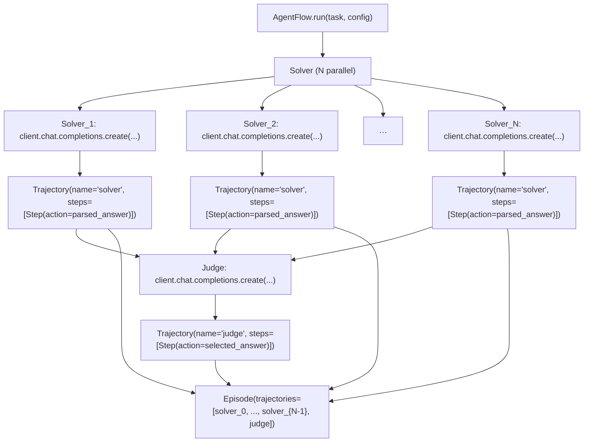

A multi-agent flow that trains a solver-judge system on the countdown task using the **AgentFlow protocol**. The solver generates N candidate solutions in parallel; the judge evaluates them and selects the best. The trainer scores each role separately so GRPO can compute advantages within each trajectory group.

This cookbook is the canonical example of returning **multiple named trajectories** from a single AgentFlow. It pairs with the longer [solver-judge tutorial](/tutorials/solver-judge-workflow), which walks through the design step by step.

## Pattern

| Aspect | Value |
|---|---|
| Loop shape | Two-stage — N parallel solver calls, then 1 judge call |
| Tools | None — solver returns text, judge returns an index |
| Trajectory names | `"solver"` (one per attempt) + `"judge"` (one per task) |
| Termination | All solver + judge calls return |
| Reward shape | Per-trajectory — solvers scored on their own answer, judge on the answer it picked |

## Architecture



The evaluator scores each trajectory independently. GRPO then groups by name across rollouts: all `solver` trajectories for one task into one group; all `judge` trajectories into another.

## Install

```bash
uv pip install -e ".[tinker]"                          # rllm + tinker backend
uv pip install -e cookbooks/solver_judge_flow          # this cookbook
rllm agent list                                        # should show "solver_judge"
```

## Dataset

```bash
rllm dataset pull countdown
```

The countdown task asks the model to combine numbers with arithmetic to reach a target — a clean reasoning testbed.

## Eval

```bash
rllm eval countdown \
    --agent solver_judge \
    --evaluator solver_judge_countdown \
    --model Qwen/Qwen3-8B \
    --base-url http://localhost:8000/v1 \
    --max-examples 20
```

## Training

```bash
# Tinker (single-machine LoRA)
bash cookbooks/solver_judge_flow/train_tinker.sh

# Verl (distributed GPU)
bash cookbooks/solver_judge_flow/train_verl.sh
```

## Key code

The flow:

```python
N_SOLUTIONS = 2

@rllm.rollout(name="solver-judge")
async def solver_judge_flow(task: Task, config: AgentConfig) -> Episode:
    client = AsyncOpenAI(base_url=config.base_url, api_key="EMPTY")
    problem = task.instruction

    # 1. Solver runs N solutions in parallel.
    solver_trajectories = await _generate_solutions(client, config.model, problem)

    # 2. Judge picks one.
    solutions = [t.steps[0].action for t in solver_trajectories]
    judge_trajectory = await _judge_solutions(client, config.model, problem, solutions)

    selected = judge_trajectory.steps[0].action
    return Episode(
        trajectories=[*solver_trajectories, judge_trajectory],
        artifacts={"answer": selected},
    )
```

The evaluator scores each trajectory independently. Solver trajectories share the per-task ground truth; the judge gets its own reward depending on whether the *selected* solution was correct:

```python
@rllm.evaluator
def solver_judge_countdown_evaluator(task: dict, episode: Episode) -> EvalOutput:
    ground_truth = {"target": task["target"], "numbers": task["nums"]}

    judge_reward = 0.0
    is_correct = False
    for traj in episode.trajectories:
        answer = traj.steps[-1].action if traj.steps else ""
        score = compute_score(str(answer), ground_truth)
        traj.reward = 1.0 if score >= 1.0 else 0.0
        if traj.name == "judge":
            judge_reward = traj.reward
            is_correct = traj.reward >= 1.0

    return EvalOutput(reward=judge_reward, is_correct=is_correct, signals=[...])
```

## Files

| File | Description |
|---|---|
| `solver_judge_flow.py` | Multi-agent AgentFlow (N parallel solvers + 1 judge) |
| `evaluator.py` | Per-trajectory reward scoring |
| `train.py` + `train_{tinker,verl}.sh` | Hydra entry points |
| `pyproject.toml` | Plugin entry-point declarations |
| `test.py` | Unit tests |

## On GitHub

<Card title="cookbooks/solver_judge_flow" icon="github" href="https://github.com/rllm-org/rllm/tree/main/cookbooks/solver_judge_flow">
  Full source, README, and runnable launch scripts
</Card>

## See also

<Card title="Solver-judge tutorial" icon="diagram-project" href="/tutorials/solver-judge-workflow">
  Step-by-step walkthrough of the design from scratch
</Card>
